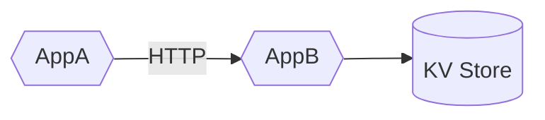
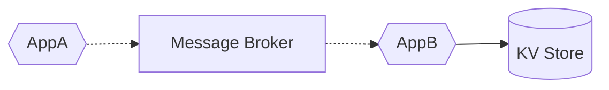
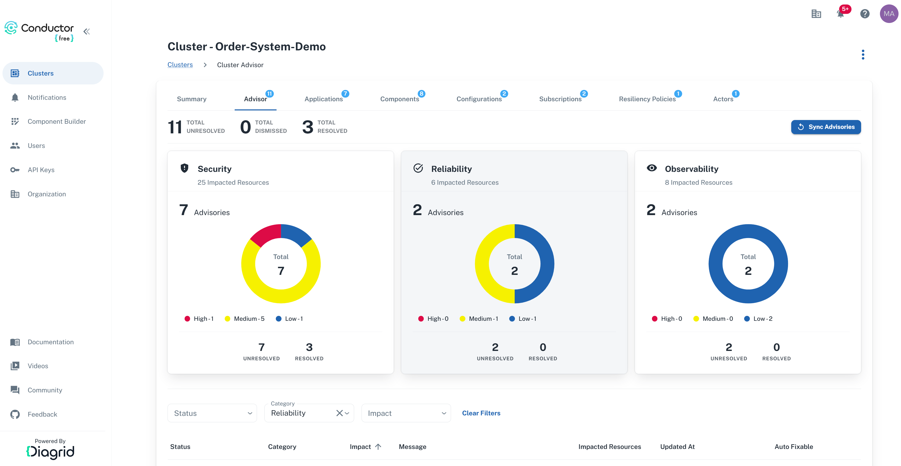
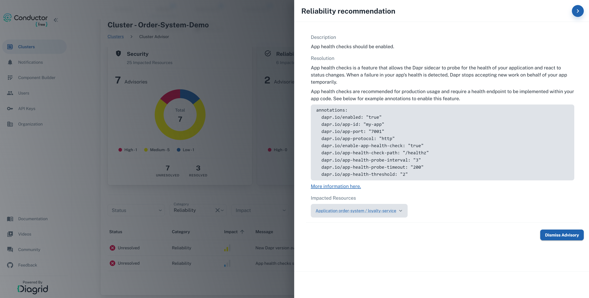

# Dapr Building Block APIs and Resiliency

This repo contains Dapr applications to demonstrate several Dapr building block APIs and the built-in resiliency capabilities.

> Running the CodeTours in this repo is recommended since this gives more context about:
>
> - The Dapr OSS project
> - Service Invocation API
> - State Management API
> - Pub/Sub API
> - Resiliency policies

## Table of Contents

- [Prequisites](#prerequisites)
- [Dapr Intro CodeTour](#dapr-intro-codetour)
- [Service Invocation CodeTour](#service-invocation-codetour)
- [State Management CodeTour](#state-management-codetour)
- [Service Invocation Demo CodeTour](#service-invocation-demo-codetour)
- [Pub/Sub CodeTour](#pubsub-codetour)
- [Pub/Sub Demo CodeTour](#pubsub-demo-codetour)
- [Dapr Reliability Advisor in Conductor Free](#dapr-reliability-advisor-in-conductor-free)
- [Resources](#resources)

## Prerequisites

Ensure you have these installed on your machine:

- [.NET 8](https://dotnet.microsoft.com/download/dotnet/8.0)
- [Dapr CLI](https://docs.dapr.io/getting-started/install-dapr-cli/)
- [Docker Desktop](https://www.docker.com/products/docker-desktop/)
- [VSCode](https://code.visualstudio.com/) - Although other IDEs can be used to view the code, some VSCode specific extensions are used (such as [CodeTour](https://marketplace.visualstudio.com/items?itemName=vsls-contrib.codetour)) to help guide you through the codebase.

Clone the [dapr-resiliency-and-durable-execution repo](https://github.com/diagrid-labs/dapr-resiliency-and-durable-execution) to your local machine.

Open the cloned repo in VSCode and accept the suggested VSCode extensions.

## Running the CodeTours

### Dapr Intro CodeTour

Using the CodeTour panel in the VSCode explorer, start the *1 - Dapr Intro* CodeTour.

### Service Invocation CodeTour

Using the CodeTour panel in the VSCode explorer, start the *2 - Service Invocation* CodeTour.

### State Management CodeTour

Using the CodeTour panel in the VSCode explorer, start the *3 - State Management* CodeTour.

### Service Invocation Demo CodeTour

Using the CodeTour panel in the VSCode explorer, start the *4 - Service Invocation Demo* CodeTour.
The BuildingBlockApisDemo consists of two applications, AppA and AppB, and a state store. Follow the instructions in the CodeTour to run the apps and use the Dapr Service Invocation API.

**Service invocation**



### Running the BuildingBlockApisDemo apps locally

1. Navigate to the BuildingBlockApisDemo folder in the terminal:

    ```bash
    cd BuildingBlockApisDemo
    ```

2. Run the BuildingBlockApisDemo apps using the Dapr CLI:

    ```bash
    dapr run -f .
    ```

3. Open the [local.http](./BuildingBlockApisDemo/local.http) file in the VSCode editor and execute the HTTP requests to the BuildingBlockApisDemo apps.

### Pub.Sub CodeTour

Using the CodeTour panel in the VSCode explorer, start the *5 - Pub/Sub* CodeTour.

### Pub.Sub Demo CodeTour

**Pub/sub**



Using the CodeTour panel in the VSCode explorer, start the *6 - Pub/Sub Demo* CodeTour and follow the instructions in the CodeTour to run the apps and use the Dapr Pub/Sub API.

### Dapr Reliability Advisor in Conductor Free

[Diagrid Conductor Free](https://www.diagrid.io/conductor) is a free tool developers can use to visualize, troubleshoot, and optimize Dapr workloads on Kubernetes. It includes an Advisor that provides recommendations on how to improve the reliability of your Dapr applications.






## Resources

- [Dapr Docs: Service Invocation](https://docs.dapr.io/developing-applications/building-blocks/service-invocation/)
- [Dapr Docs: State Management](https://docs.dapr.io/developing-applications/building-blocks/state-management/)
- [Dapr Docs: Pub/Sub](https://docs.dapr.io/developing-applications/building-blocks/pubsub/)
- [Dapr Docs: Resiliency](https://docs.dapr.io/operations/resiliency/)
- [Diagrid Conductor Free](https://www.diagrid.io/conductor)