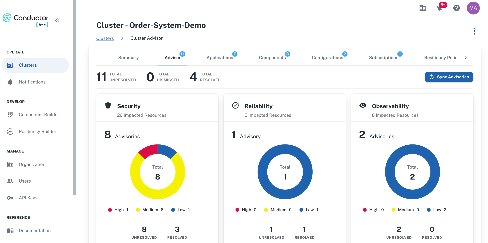
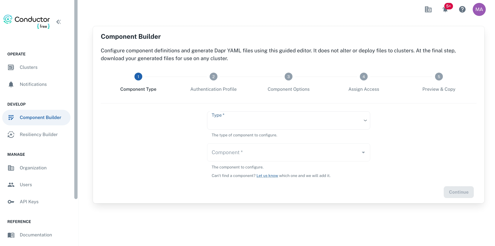
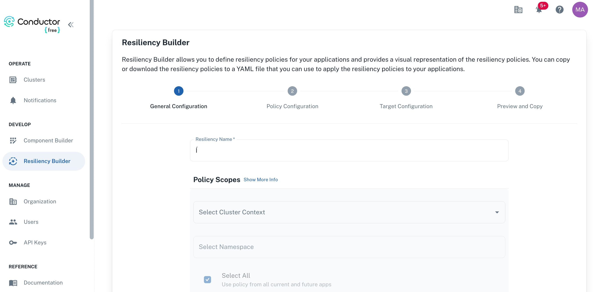

# Dapr Building Block APIs

This repo contains Dapr applications to demonstrate several Dapr building block APIs and the built-in resiliency capabilities.

> Running the CodeTours in this repo is recommended since this gives more context about:
>
> - The Dapr OSS project
> - Service Invocation API
> - State Management API
> - Pub/Sub API
> - Resiliency policies

## Table of Contents

- [Prequisites](#prerequisites)
- [Dapr Intro CodeTour](#dapr-intro-codetour)
- [Service Invocation CodeTour](#service-invocation-codetour)
- [State Management CodeTour](#state-management-codetour)
- [Service Invocation Demo CodeTour](#service-invocation-demo-codetour)
- [Pub/Sub CodeTour](#pubsub-codetour)
- [Pub/Sub Demo CodeTour](#pubsub-demo-codetour)
- [Diagrid Conductor Free](#diagrid-conductor-free)
- [Resources](#resources)

## Prerequisites

Ensure you have these installed on your machine:

- [.NET 8](https://dotnet.microsoft.com/download/dotnet/8.0)
- [Dapr CLI](https://docs.dapr.io/getting-started/install-dapr-cli/)
- [Docker Desktop](https://www.docker.com/products/docker-desktop/)
- [VSCode](https://code.visualstudio.com/) - Although other IDEs can be used to view the code, some VSCode specific extensions are used (such as [DemoTime](https://marketplace.visualstudio.com/items?itemName=eliostruyf.vscode-demo-time)) to help guide you through the slides and the codebase.
- For *Demo 1b* a Postgres database is required that can be installed via docker:

    ```bash
    docker pull postgres:latest
    docker run --name postgres -e POSTGRES_PASSWORD=postgres123 -d postgres -p 5432:5432 
    ```

1. Clone the this repo to your local machine.
2. Open the cloned repo in VSCode and accept the suggested VSCode extensions.

## Running the demos with DemoTime

Click the play button in the DEMO TIME panel in the explorer to start the slide show.

Progress through the slides and demos by clicking the DEMO TIME icon in the status bar or the next step in the DEMO TIME panel in the explorer.

**Demo 1a, 1b, 2**


**Demo 3**


**Demo 4**


### Diagrid Conductor Free

[Diagrid Conductor Free](https://www.diagrid.io/conductor) is a free tool developers can use to visualize, troubleshoot, and optimize Dapr workloads on Kubernetes. It includes an Advisor that provides recommendations on how to improve the reliability of your Dapr applications.



Conductor Free also comes with two builders to generate Dapr *component files* and *resiliency policies* so you don't have to figure out the correct yaml schema yourself.





## Resources

- [Dapr Docs: Service Invocation](https://docs.dapr.io/developing-applications/building-blocks/service-invocation/)
- [Dapr Docs: State Management](https://docs.dapr.io/developing-applications/building-blocks/state-management/)
- [Dapr Docs: Pub/Sub](https://docs.dapr.io/developing-applications/building-blocks/pubsub/)
- [Dapr Docs: Resiliency](https://docs.dapr.io/operations/resiliency/)
- [Diagrid Conductor Free](https://www.diagrid.io/conductor)